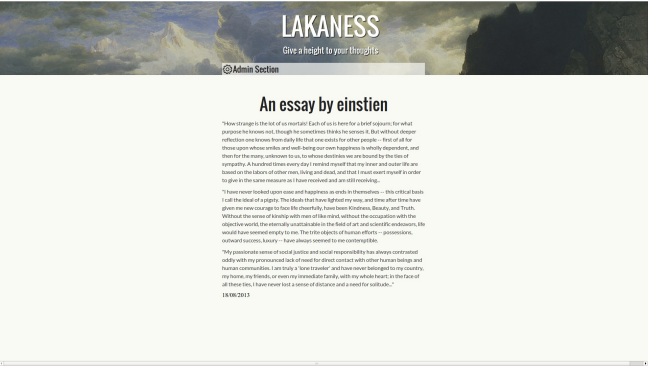
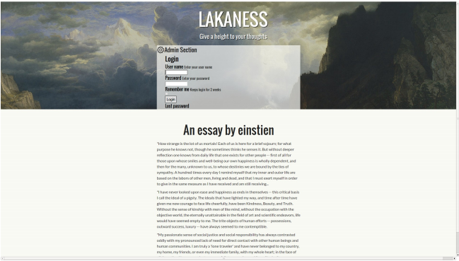
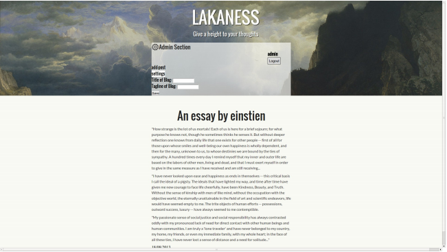
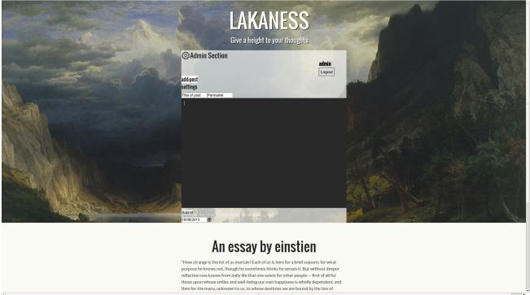

# Laka Blogging Engine

## What is Laka Blogging Engine?
Laka Blogging Engine is first ever blogging engine designed in C++ using Wt framework. 
This is specially designed for bloggers with markdown and plain text editor. This is not the whole CMS but a blogging engine.
In this, user can create his account and some cool stories with images and can share with his friends using permalink. 

## A small Presentation. 
<iframe src="//www.slideshare.net/slideshow/embed_code/key/ytH4dSjeUCYsfW" width="595" height="485" frameborder="0" marginwidth="0" marginheight="0" scrolling="no" style="border:1px solid #CCC; border-width:1px; margin-bottom:5px; max-width: 100%;" allowfullscreen> </iframe> 
 <strong> <a href="//www.slideshare.net/amitoj95/presentation-27722378" title="Laka Blogging engine" target="_blank">Laka Blogging engine</a> </strong> from <strong><a href="https://www.slideshare.net/amitoj95" target="_blank">Amitoj Singh</a></strong> 

## Screenshots
posts in Lakaness

Entering Lakaness

Editting the title and tagline

Editting the post



