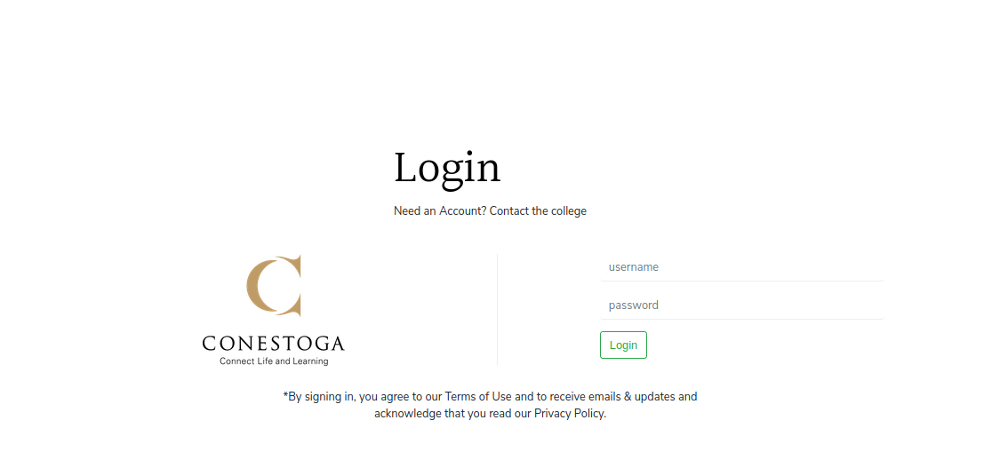
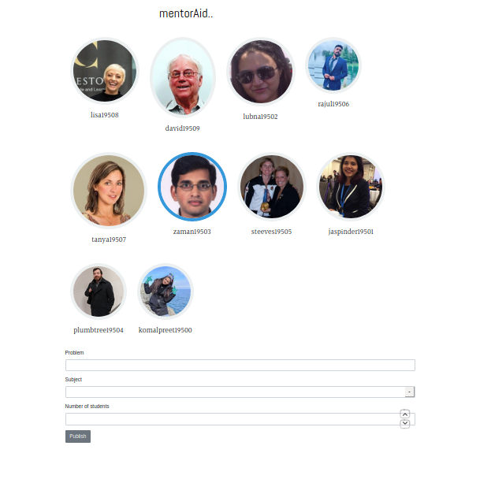
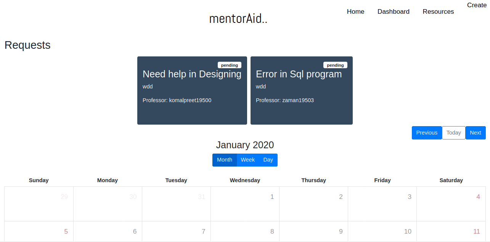

# Mentor Aid

Mentor Aid is **Meeting Schedular** application for students to book appointment with teachers in Colleges and universities. It can be integrated with any college as **LDAP authentication** is used in back-end

[github]: https://github.com/amitojsingh/mentoraid

## Installing Mentor Aid ?
To install Mentor Aid, you need to first install the Whole MEAN(Mongo, Express, Angular, Node).
After installing
<b> Clone Mentor Aid </b>  
<code> git clone https://github.com/amitojsingh/mentoraid </code>  

Go into root directory and run  
<code> npm install</code>  
After successfull completion run the server  
<code>npm start</code>  

then go to <code>app_public </code>directory and run  
<code>npm install</code>  
After completion run the server  
<code>ng serve</code>
for more details check the [github]
## Screenshots
**Login page for user**

**Creating Request by user to the Teacher/professor**

**Display all the pending and accepted request**



