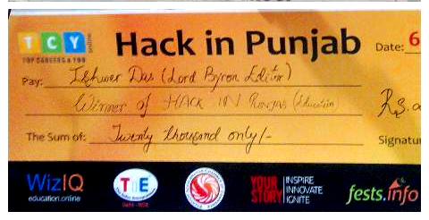
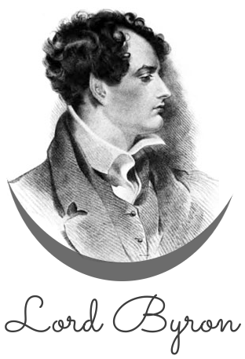
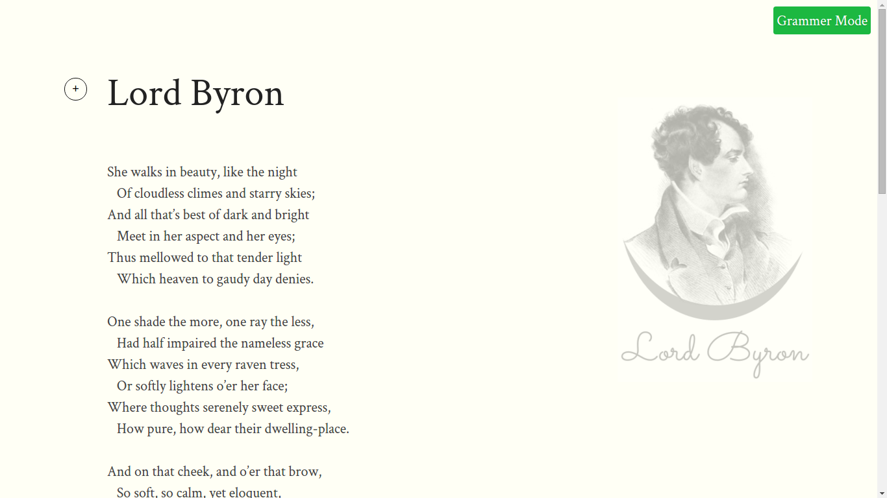
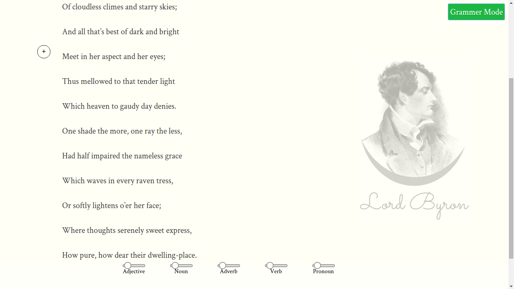

# LordByron

## Story behind Lord byron

Lord byron came into existence at punjab's first 36 hours hackathon. This hackathon was hosted by TCY (Top Carreres & You) Ludhiana.  
We were 4 developers and registered in this hackathon as a team named Ishwerdas. Everyone liked the idea and technology behind Lord byron.  
Lord byron was titled as most innovative project in education category in this hackathon. yayy!  

## What is Lord Byron ?

Lord byron is a real time editor built using <a href="http://meteor.com">Meteor</a>
In this all users can edit the same document at same time, and also observe the changes of other users in real time.  
Apart from being real time the main feature of this editor is to check grammar. It uses Natural Language Processing (NLP) to check the grammar. It highlights various parts of speech.

## Installing Lord Byron ?
To install Lord byron, you need to first install meteor.
<b> Install Meteor</b>  
<code> curl http://install.meteor.com | sh </code>
  
<b> Clone Lord Byron </b>  
<code> git clone https://github.com/amitojsingh/lord-byron.git </code>

Go into lord byron directory and run meteor command

<code> meteor</code>

## Screenshots
Note in lord-byron

Grammar mode in lord-byron



