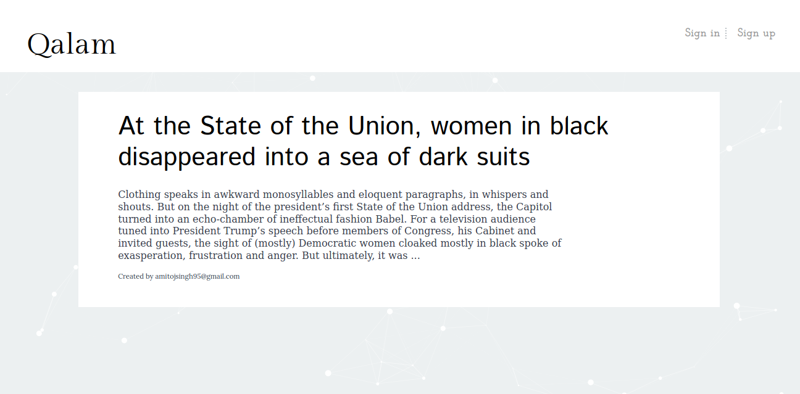
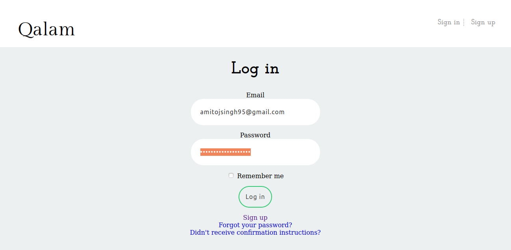
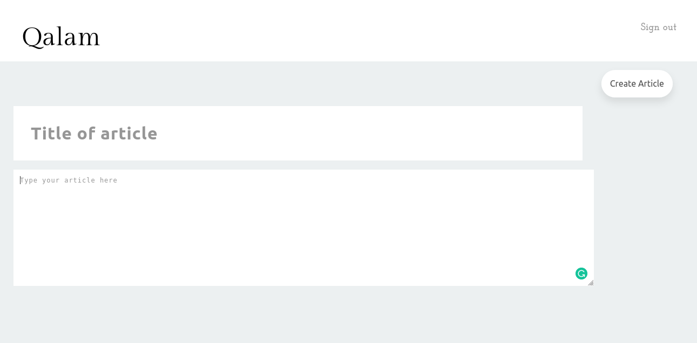
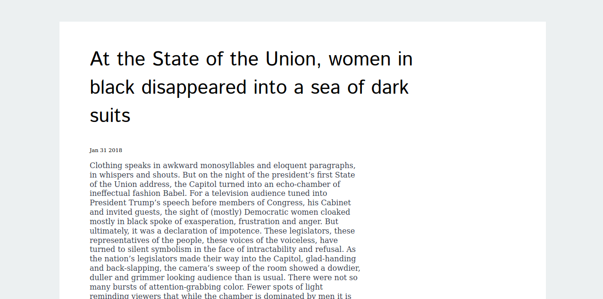

# Qalam

Qalam is most pleasing and cordial blog application design and develop in Ruby On Rails using Test Driven Development.  
Basically, Qalam will help the user who loves to write blog and share his story with Plain Text format

## Installing Qalam ?
To install Qalam, you need to first install Rails.  
<b> Install Ruby On Rails from <a href = "https://gorails.com/setup/">Go rails</a></b>  
<b> Clone Qalam </b>  
<code> git clone https://github.com/amitojsingh/Qalam </code>

Go into Qalam Directory and run bundle command

<code> bundle install</code>

 Run the project using rails

<code>rails s</code>

## Screenshots
Login in Qalam

Create mode in Qalam

Display Post mode in Qalam



